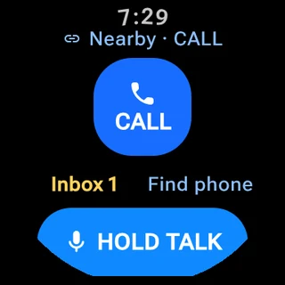
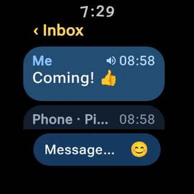

# HappyTalky

HappyTalky is a small Android + Wear OS companion app for direct, child-friendly communication between a phone and a paired watch.

The product is intentionally centered on two obvious actions:

- **CALL** for live two-way voice;
- **TALK** for persistent push-to-talk voice messages.

TEXT messaging, proximity finding, history and accessibility helpers sit behind those primary actions instead of competing with them.

## What it does

| Feature | Behavior |
| --- | --- |
| **CALL** | Live bidirectional voice over Wear OS Data Layer when the paired HappyTalky peer is reachable. |
| **Priority CALL** | Phone-initiated locked call for urgent contact. The Watch exposes no normal Decline/End control; the Phone remains the product-level endpoint that can cancel/end it. |
| **TALK** | Hold to record, release to send. Voice messages persist locally and can synchronize after temporary disconnection. |
| **TEXT** | Persistent text/emoji messages in the same timeline as TALK and CALL history. |
| **Watch read-aloud** | Long-press a TEXT row on Watch to read it locally with Android TextToSpeech; long-press again to stop. |
| **Find Watch / Find Phone** | Short-lived BLE RSSI guidance using qualitative proximity/trend rather than fake exact distance or direction. |

Phone and Watch keep the child-facing surface compact while sharing protocol and conversation state through the common `core` module.

## Screenshots

These images are generated from the checked-in Compose screenshot suite on current `main`.

| Phone conversation | Find Watch |
| :---: | :---: |
|  |  |

| Watch home | TEXT read-aloud |
| :---: | :---: |
|  |  |

## Connectivity model

HappyTalky uses Wear OS Data Layer for companion discovery, signaling and synchronized data.

A live CALL does **not** require the Phone and Watch to share the same Wi-Fi network. If the HappyTalky capability node is reachable through the Data Layer, remote CALL is allowed whether the local phone is on Wi-Fi or carrier data. A valid topology is therefore:

```text
Phone 4G / 5G
      |
Wear OS Data Layer
      |
Watch Wi-Fi
```

The UI distinguishes nearby, remote, reconnecting and offline states, but does not pretend to know the remote device's exact last-mile Wi-Fi/LTE transport when Wear OS does not expose it.

TALK and TEXT are more tolerant of temporary disconnection because they use persistent Data Layer data rather than only transient live signaling.

## Priority CALL

Priority CALL is a separate immediate Phone-to-Watch request. It does not begin as a normal CALL and does not wait for a timeout before escalating.

On a compatible Watch:

- the request is visually distinct from a normal CALL;
- there is no normal Watch Decline action;
- there is no normal Watch End action once the locked call is active;
- the Phone can cancel while pending and end once connected;
- genuine route, permission, Telecom or process failures can still terminate the call.

Android background microphone restrictions still apply. The current implementation uses AndroidX Core-Telecom for the background locked-Priority path and falls back to visible-app handling when that platform path is unavailable.

See [Architecture](docs/ARCHITECTURE.md) for the exact state machine and protocol paths.

## Conversation model

TEXT, TALK and CALL events share one local Room-backed timeline on each endpoint.

- TALK audio stays in app-private storage and is referenced from conversation metadata.
- TEXT uses persistent Data Layer DataItems and can remain queued while a previously compatible peer is offline.
- CALL events retain outcome, mode and duration metadata.
- Watch TEXT read-aloud is local presentation only; no TTS audio or playback state is synchronized to Phone.
- Deleting a timeline item is local history management, not remote recall.

## UI model

Phone and Watch share product semantics, not page layout.

- **Phone:** Jetpack Compose + Material 3, with CALL/TALK as the primary actions and TEXT/history as supporting communication.
- **Watch:** Wear Compose Material 3, designed independently for a small round screen with route/status, CALL, TALK and Inbox kept glanceable.
- **CI:** Phone and 192 dp round-Watch screenshot suites render before debug APK publication.

The project-specific UI contract lives in [docs/UI_GUIDELINES.md](docs/UI_GUIDELINES.md).

## Build and install

Phone and Watch builds use the same application ID:

`com.xiaolong.happytalky`

They must also use matching signing identities for Wear OS Data Layer communication.

The fastest development path is the rolling `debug-main` release, which contains matching Phone and Watch APKs built from the same commit. PRs use one rolling `debug-pr-<number>` prerelease and those temporary releases/tags are removed after merge.

See:

- [Deploy, install and manual acceptance](docs/DEPLOY.md)
- [Debug distribution lifecycle](dist/README.md)

The authoritative app version is defined in the Phone and Watch Gradle module configuration; documentation should not duplicate that number as mutable release metadata.

## Validation status

Automated build success, screenshot rendering and physical-device validation are different claims.

Current feature-by-feature status is maintained in one place:

[**docs/VALIDATION.md**](docs/VALIDATION.md)

In particular, experimental or recently changed hardware behavior should not be inferred from a green CI build alone.

## Documentation

Start with [docs/README.md](docs/README.md).

Canonical current-state documents:

- [Architecture](docs/ARCHITECTURE.md) — protocol, persistence, routing and communication state machines.
- [Deploy and validation procedure](docs/DEPLOY.md) — installation, build baseline and acceptance checks.
- [Validation status](docs/VALIDATION.md) — CI vs physical-device evidence.
- [UI development baseline](docs/UI_GUIDELINES.md) — Phone/Wear design and interaction invariants.
- [Debug distribution](dist/README.md) — APK prerelease/tag lifecycle.

Historical closure notes are retained for provenance but are not current requirements.

## Experimental work

The repository also contains a debug-only [Wear OS captive-portal proof of concept](docs/WEAR_CAPTIVE_PORTAL_POC.md). It is isolated from the child-facing CALL/TALK UI and should be treated as experimental until its hardware gate is explicitly closed in the validation document.

## Tech stack

Kotlin, Jetpack Compose, Wear Compose Material 3, Wear OS Data Layer, Room, AndroidX Core-Telecom, Android TextToSpeech and BLE.

## License

MIT
